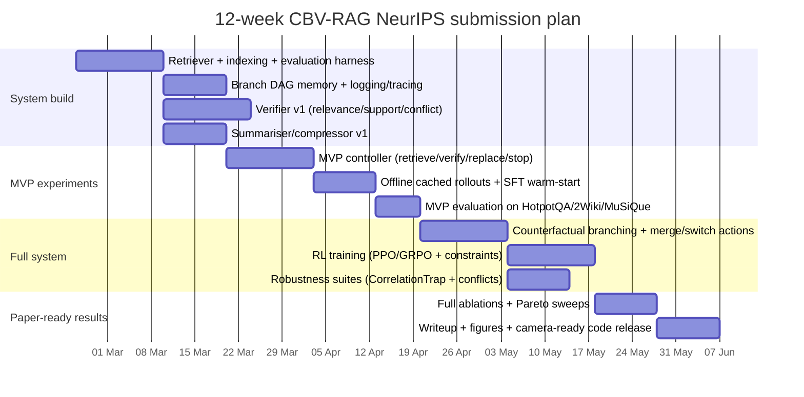

# Counterfactual Branch-and-Verify RL Controllers for RAG

## Executive summary

A single, end-to-end **RL controller for RAG** that explicitly supports **counterfactual branching plus branch management actions (verify / replace / branch / merge / switch / stop / summarise)** does **not** appear to exist as a unified prior system in 2020–Feb 2026, based on the closest matching papers and official artefacts located in this review. Instead, the literature contains **strong partial matches**: (i) *counterfactual evidence generation + parallel arbitration* without RL (CF-RAG), (ii) *multi-branch retrieval trees* with RL but without counterfactual verification/merge semantics (R²AG), and (iii) *RL for search/retrieval control* (Search-R1, ReSearch, R3-RAG, Stop-RAG, TreePS-RAG, RouteRAG, ReasonRAG) that largely operates in **linear** (non-explicitly branched) trajectories or uses trees primarily for **credit assignment** rather than hypothesis management. citeturn12view2turn12view3turn16view0turn16view1turn4view1turn24view1turn35view0

The most defensible NeurIPS-ready angle is therefore not “RL for retrieval” (now crowded), but **“robust error-recovery under misleading evidence”**: an RL controller that (a) **detects retrieval traps** (correlation/misinformation/irrelevance), (b) **spawns counterfactual branches**, (c) **verifies and replaces evidence**, and (d) **merges/switches branches under explicit token/latency constraints**. This directly targets failure modes identified in CF-RAG (Correlation Trap), CRAG/CoV-RAG (retrieval mistakes + correction), and robustness-to-irrelevant-context work, while adding an explicit **branch-and-verify decision layer** trained as a constrained sequential decision process. citeturn12view2turn12view3turn19view2turn26view0turn17search1

## Closest prior work and overlap map

### Prioritised closest matches with annotations and gaps

Below is a prioritised set of papers/posts (2020–2026) that most closely match *any portion* of your proposed “counterfactual/branch-and-verify RL controller” idea. Each entry includes a URL (inline code) plus a short overlap/gap note.

**CF-RAG: Counterfactual Reasoning for Retrieval-Augmented Generation (2026, ICLR poster)** — `https://openreview.net/pdf/f86a234929c7c43729b1b116dd9eeb79dfaa0cb5.pdf`  
Overlaps: explicitly frames a “Correlation Trap”, generates and evaluates **counterfactual queries**, and uses **parallel arbitration** to reconcile conflicting evidence. Gaps: not an RL controller; no learned branch-management policy with actions like switch/merge as RL decisions (it is an algorithmic framework). citeturn12view2turn12view3

**R²AG: Learning to Reason, Retrieve, and Self-Evolve through a Multi-Branch Retrieval Tree (2025/2026, ICLR submission)** — `https://openreview.net/pdf/9fc3e19b68c4c8079c1c0a659f42c08982717132.pdf`  
Overlaps: explicit **multi-branch retrieval tree**; RL trains a steering model; introduces constraints to manage branch explosion and promote accurate branches. Gaps: branching is about *retrieval-chain expansion*, not counterfactual verification/arbitration; “merge/switch/replace” semantics are not the core action space. citeturn16view0turn16view1turn16view2

**TreePS-RAG: Tree-based Process Supervision for RL in Agentic RAG (2026, arXiv)** — `https://arxiv.org/html/2601.06922v1`  
Overlaps: models rollouts as a **tree** and uses descendant outcome estimates for **step-wise credit assignment** without intermediate labels. Gaps: tree is primarily for *training signal*, not for explicit hypothesis branch memory with merge/switch actions at inference. citeturn24view1

**Stop-RAG: Value-Based Retrieval Control for Iterative RAG (2025, arXiv)** — `https://arxiv.org/html/2510.14337v1`  
Overlaps: casts iterative RAG as a **finite-horizon MDP**, trains a value-based controller to **stop/continue retrieval** and constructs offline datasets from full trajectories. Gaps: action space is essentially stop/continue; no branching/verification actions. citeturn22view0turn22view1

**R3-RAG: Learning Step-by-Step Reasoning and Retrieval via RL (2025, arXiv / EMNLP Findings)** — `https://arxiv.org/html/2505.23794v1`  
Overlaps: RL trains iterative reason–retrieve; introduces outcome reward plus **process reward via relevance-based document verification**. Gaps: verification is used as *reward shaping*, not as an explicit controller action; no branch/merge. citeturn27view0

**Search-R1: Training LLMs to Reason and Leverage Search via RL (2025, arXiv)** — `https://arxiv.org/abs/2503.09516`  
Overlaps: multi-turn search interactions; RL optimises trajectories; explicitly about learning to generate search queries during reasoning. Gaps: no explicit branch memory/merge/switch; “counterfactual” not central. citeturn4view3

**ReSearch: Learning to Reason with Search via RL (2025, arXiv)** — `https://arxiv.org/html/2503.19470v3`  
Overlaps: integrates `<search>` operations inside reasoning chain; trained with RL without supervised reasoning steps. Gaps: no explicit hypothesis branching/merge actions. citeturn8view3

**ReasonRAG / RAG-ProGuide: process-supervised RL for agentic RAG (2025, arXiv; NeurIPS poster)** — `https://arxiv.org/html/2505.14069v1`  
Overlaps: argues outcome-only RL suffers from sparse rewards; introduces process-level rewards for query generation/evidence extraction/answer generation; claims improved training efficiency and fewer training instances than Search-R1. Gaps: process supervision focuses on linear tool-use; not explicitly counterfactual or branch-merge hypothesis control. citeturn35view0turn33search0

**TIRESRAG-R1: think–retrieve–reflect with multi-dimensional rewards (2025, arXiv)** — `https://arxiv.org/html/2507.22716v2`  
Overlaps: explicit **reflection** and revision loops; introduces sufficiency/reasoning-quality/reflection rewards. Gaps: reflection is not a branch-and-merge hypothesis DAG; no counterfactual arbitration. citeturn6view0

**CRAG: Corrective Retrieval Augmented Generation (2024, arXiv / OpenReview)** — `https://ar5iv.labs.arxiv.org/html/2401.15884`  
Overlaps: explicit evaluator returns confidence and triggers different retrieval actions; uses web search extension and decompose–recompose; emphasises robustness when retrieval is wrong. Gaps: the “controller” is not formulated/trained as RL over branch actions; no multi-branch hypothesis memory. citeturn19view2

**CoV-RAG: Chain-of-Verification for RAG (2024, arXiv / EMNLP Findings)** — `https://arxiv.org/abs/2410.05801`  
Overlaps: integrates a verification module (scoring/judgement/rewriting) to correct retrieval and generation inconsistencies. Gaps: not RL controller; not branch merge. citeturn26view0

**MCTS-RAG (2025, arXiv / EMNLP Findings) and AirRAG (2025, arXiv)** — `https://arxiv.org/html/2503.20757v1`, `https://arxiv.org/html/2501.10053v1`  
Overlaps: explicit **action spaces** containing retrieval and summarisation actions; use **tree search** (MCTS) and include “knowledge reflection” or analysis actions. Gaps: inference-time MCTS, not RL policy learning of branch/merge/switch under budgets in a RAG CMDP. citeturn25view0turn21view0

**Plan*RAG (2025, ICLR workshop)** — `https://openreview.net/pdf?id=gi9aqlYdBk`  
Overlaps: externalises multi-hop reasoning as a **DAG** outside the LM context; targets efficiency and structured decomposition; notes verification/backtracking-like properties via external structure. Gaps: not RL; not counterfactual evidence arbitration. citeturn12view0turn12view1

**Self-RAG (2023/2024, ICLR)** — `https://selfrag.github.io/`  
Overlaps: adaptive retrieve/skip retrieval; critique tokens assess relevance/support; segment-level control and citation/factuality focus. Gaps: no explicit branch-and-merge controller; not counterfactual branching as a decision process. citeturn27view3

**RECOMP (2023, arXiv)** — `https://arxiv.org/html/2310.04408`  
Overlaps: explicit **compression/summarisation** of retrieved docs; can output empty string (“selective augmentation”) to save compute/tokens. Gaps: not RL branch control; compression is trained as a component rather than a controller. citeturn27view2

**Robustness to noisy/irrelevant context (2023–2024)**: “Making Retrieval-Augmented LMs Robust to Irrelevant Context” (2023/ICLR), “FILCO” context filtering (2023), “Chain-of-Note” (2023/2024)  
Overlaps: “replace/filter” behaviours and robustness framing; data-based or model-based filtering and note-taking to handle irrelevant docs. Gaps: not RL branch control with counterfactual arbitration. citeturn17search1turn17search0turn17search2

**Conflict/ambiguity benchmarks + multi-agent arbitration (2025, COLM)**: RAMDocs + MADAM-RAG — `https://arxiv.org/abs/2504.13079`  
Overlaps: explicitly targets ambiguity + misinformation + noise; proposes debate + aggregator that discards misinformation and handles ambiguous entities. Gaps: not RL controller; branching is multi-agent debate rather than a single RL branch DAG with counterfactual actions. citeturn34search2

### Table A: Coverage matrix of closest prior systems

Legend: ✓ = core, ◐ = partial/implicit, — = not a focus.

| Paper / system | Year | Venue | retrieve | stop | summarise | verify | branch | replace/filter | robustness |
|---|---:|---|:---:|:---:|:---:|:---:|:---:|:---:|:---:|
| CF-RAG | 2026 | ICLR poster | ✓ | — | ◐ | ✓ | ✓ | ◐ | ✓ citeturn12view2turn12view3 |
| R²AG (multi-branch retrieval tree + RL steering) | 2025 | ICLR submission | ✓ | ◐ | — | — | ✓ | ◐ | ◐ citeturn16view0turn16view1turn16view2 |
| TreePS-RAG | 2026 | arXiv | ✓ | ◐ | — | — | ◐ | — | ◐ citeturn24view1 |
| Stop-RAG | 2025 | arXiv | ✓ | ✓ | — | — | — | — | ◐ citeturn22view0turn22view1 |
| R3-RAG | 2025 | arXiv / EMNLP Findings | ✓ | ◐ | — | ◐ (process reward) | — | — | ◐ citeturn27view0 |
| Search-R1 | 2025 | arXiv | ✓ | ◐ | — | — | — | — | ◐ citeturn4view3 |
| ReSearch | 2025 | arXiv | ✓ | ◐ | — | ◐ (reflection/self-correction emerges) | — | — | ◐ citeturn8view3 |
| RouteRAG (graph+text RL retrieval routing) | 2025 | arXiv | ✓ | ✓ | — | — | — | — | ◐ citeturn28view0turn28view3 |
| ReasonRAG / RAG-ProGuide | 2025 | arXiv / NeurIPS poster | ✓ | ◐ | — | ◐ (process rewards) | — | ◐ (evidence extraction) | ◐ citeturn35view0turn33search0 |
| TIRESRAG-R1 | 2025 | arXiv | ✓ | ◐ | — | ◐ (reflection reward) | — | — | ◐ citeturn6view0 |
| CRAG | 2024 | arXiv / OpenReview | ✓ | ◐ | ◐ | ✓ | — | ✓ | ✓ citeturn19view2 |
| CoV-RAG (Chain-of-Verification) | 2024 | arXiv / EMNLP Findings | ✓ | — | — | ✓ | — | ◐ (rewrite) | ◐ citeturn26view0 |
| MCTS-RAG | 2025 | arXiv / EMNLP Findings | ✓ | ◐ | ✓ | ◐ (reflection step) | ✓ | — | ◐ citeturn25view0 |
| AirRAG | 2025 | arXiv | ✓ | ◐ | ✓ | ◐ | ✓ | — | ◐ citeturn21view0turn21view1 |
| Plan*RAG | 2025 | ICLR workshop | ✓ | — | ◐ | ◐ | ✓ (DAG paths) | ◐ | ◐ citeturn12view0turn12view1 |
| Self-RAG | 2024 | ICLR | ✓ | ◐ | — | ✓ | — | ◐ | ◐ citeturn27view3 |
| RECOMP | 2023 | arXiv | ✓ | ◐ (empty-string) | ✓ | — | — | ◐ | ◐ citeturn27view2 |
| Robust-to-irrelevant-context (Yoran et al.) | 2023 | arXiv / ICLR | ✓ | — | — | ✓ (NLI filter / training) | — | ✓ | ✓ citeturn17search1 |
| FILCO (context filtering) | 2023 | arXiv | ✓ | — | — | ◐ | — | ✓ | ✓ citeturn17search0 |
| Chain-of-Note | 2023 | arXiv / EMNLP | ✓ | — | ◐ | ✓ | — | ◐ | ✓ citeturn17search2turn17search6 |

## Novelty analysis and recommended sharp claim

### What is already “covered enough” to be non-novel by 2026

**RL for “when to search / how many docs / when to stop”** is now well represented: Stop-RAG formalises stopping as an MDP; RouteRAG explicitly trades correctness vs retrieval efficiency; DynamicRAG uses RL to pick the number/order of documents via an RL reranker; Search-R1/ReSearch/R1-Searcher/R3-RAG cover multi-turn retrieval via RL. citeturn22view0turn28view0turn35view1turn4view3turn8view3turn35view2turn27view0

**Tree-structured reasoning or multi-path exploration** exists primarily either as inference-time search (MCTS-RAG, AirRAG) or as a retrieval-tree expansion strategy with RL (R²AG), while TreePS-RAG uses trees for process credit assignment. citeturn25view0turn21view0turn16view1turn24view1

**Verification and correction modules** (non-RL) exist in CRAG and CoV-RAG, and many robustness papers show filtering/entailment checks or note-taking to handle irrelevant context. citeturn19view2turn26view0turn17search1turn17search2

**Counterfactual evidence exploration** is explicitly introduced by CF-RAG as a robustness mechanism, but not within an RL controller action space. citeturn12view2turn12view3

### Components that remain plausibly novel in combination

The gap your idea can occupy (i.e., likely “publishable novelty”) is the **explicit, learned, counterfactual branch-and-verify control layer**:

1. **Branching as hypothesis management, not just retrieval expansion**:  
   R²AG branches retrieval chains; CF-RAG runs counterfactual queries; MCTS-RAG explores multiple reasoning paths. None appear to implement a single RL controller operating over an explicit hypothesis/evidence DAG with actions like **branch, switch active branch, merge branches, and replace evidence** as first-class RL decisions under budget constraints. citeturn16view1turn12view3turn25view0

2. **Counterfactual branching + verification-driven evidence repair as a learned policy**:  
   CF-RAG proposes counterfactual testing and parallel arbitration as a framework, but not a learned controller; CRAG provides corrective actions but not an RL-learned branch policy. A learned controller that chooses when to spawn counterfactual branches, verify claims, and replace evidence can be argued as the missing unification. citeturn12view3turn19view2

3. **Explicit budgeted robustness objective (CMDP) across accuracy, cost, and error recovery**:  
   Stop-RAG and RouteRAG incorporate efficiency motivations, but a **branching robustness controller** can make “error recovery rate under adversarial retrieval noise” a primary objective aligned with CF-RAG’s Correlation Trap and RAMDocs-style conflicting evidence settings. citeturn22view0turn28view0turn12view2turn34search2

### Recommended novelty claim

A reviewer-sharp claim that avoids crowded territory:

> **Counterfactual Branch-and-Verify RAG (CBV-RAG):** formulate RAG as a **constrained POMDP** in which a learned RL controller maintains a **hypothesis/evidence DAG** and learns **when to spawn counterfactual branches, verify and replace evidence, switch/merge branches, summarise state, and stop**, optimising an accuracy–cost–robustness frontier on multi-hop QA and retrieval-trap stress tests.

This positioning ties directly to the explicit vulnerabilities and partial solutions in CF-RAG, CRAG/CoV-RAG, and the RL-for-agentic-RAG line, while claiming the missing **action space + memory structure + constrained optimisation**. citeturn12view2turn19view2turn26view0turn22view0turn24view1

### Concrete research questions

A NeurIPS-appropriate central RQ:

**RQ1.** *Does an RL controller with counterfactual branch-and-verify actions improve robustness to retrieval traps (correlation/ambiguity/misinformation/irrelevance) at fixed token/latency budgets compared to linear agentic RAG RL and non-RL counterfactual frameworks?* citeturn12view2turn4view3turn22view0turn34search2

Supporting RQs that make the paper evaluable:

**RQ2.** *Which actions (verify/replace/branch/merge/switch/summarise/stop) contribute most to error recovery, and under what budget regimes?* (Ablation-driven.) citeturn22view0turn12view4turn16view3

**RQ3.** *Can tree-based process credit assignment (TreePS-like) stabilise learning for long-horizon branch control without human intermediate labels?* citeturn24view1turn22view0

## Formal CMDP/POMDP specification

This section gives one clean formulation that matches your action set and is faithful to how iterative RAG has been cast as decision processes (e.g., Stop-RAG’s finite-horizon MDP framing). citeturn22view0turn22view1

### Environment type

Model as a **Constrained POMDP (CPOMDP)**:

- True latent state \(x_t\): includes the (unknown) relevant evidence set, latent answer, and latent “trap structure” (misleading correlated evidence, misinformation, ambiguity). This is unobserved. CF-RAG’s Correlation Trap and RAMDocs’ conflicting evidence motivate partial observability. citeturn12view2turn34search2
- Observation \(o_t\): what the controller can see: user query, current branch memory (summaries + retrieval metadata), verifier scores, and retriever outputs. (Deterministic function of internal branch memory plus stochastic retrieval.) citeturn19view2turn17search1turn27view2

### State (controller observation) representation

Let the controller operate on a structured observation \(o_t\) consisting of:

- **Global**: original question \(q\); budget remaining \(B^{tok}_t, B^{lat}_t\); step index \(t\).
- **Branch DAG**: a set of branches \( \mathcal{B}_t = \{b_i\}\). Each branch has:
  - branch summary \(s_i\) (compressed memory);
  - current subquery \(u_i\);
  - retrieved evidence set \(D_i\) with retrieval scores / ranks;
  - draft answer \(a_i\) (optional);
  - verifier outputs: support/contradiction/irrelevance scores for each evidence chunk and for \(a_i\).  
  These echo the “iterative trace as state” idea used in Stop-RAG (state as prior interaction records) while extending to multiple branches. citeturn22view1turn27view2turn17search1
- **Active pointer**: active branch id \(b_{\mathrm{act}}\) used for the next generation/retrieval action.

### Action space

A mixed discrete + parameterised action space (the key novelty lever).

Discrete actions \(\mathcal{A}_d\):

1. **stop**: terminate and emit final answer from a selected branch (or merged result).
2. **summarise(branch)**: compress branch memory to a budgeted summary (token-saving move; cf. RECOMP, and also “summary-answer” in AirRAG/MCTS-RAG action sets). citeturn27view2turn21view0turn25view0
3. **verify(branch, target)**: run verifier on either (a) draft answer vs evidence, or (b) evidence-evidence consistency, or (c) evidence relevance to subquestion; inspired by CRAG’s retrieval evaluator and CoV-RAG’s verification module. citeturn19view2turn26view0turn17search1
4. **replace(branch, evidence_subset)**: drop or downweight evidence chunks flagged as irrelevant/contradictory; aligns with context filtering/robustness literature (FILCO, robust-to-irrelevant-context) and with CRAG’s decompose–recompose idea. citeturn17search0turn17search1turn19view2
5. **branch(branch, mode)**: fork a new branch from an existing one. Two modes:
   - **counterfactual branch**: generate counterfactual query variants (CF-RAG style). citeturn12view3
   - **decomposition branch**: spawn a subquestion chain (Plan*RAG / IRCoT / MCTS-RAG style “decompose” actions). citeturn12view1turn27view1turn25view0
6. **switch(branch)**: change active branch (policy-level control over where to spend budget next).
7. **merge(branch_set)**: combine evidence + conclusions across branches with arbitration (in spirit of CF-RAG parallel arbitration and Guideline Forest stepwise aggregation, but here as an explicit action). citeturn12view3turn21view3

Parameterised actions \(\mathcal{A}_p\):

- **retrieve(branch, query, k, source_selector)** where:
  - query is chosen from a candidate set \(C^{query}(o_t)\) (see implementation blueprint);
  - \(k\) is chosen from a small discrete set (e.g., {3, 5, 10, 20});
  - source_selector chooses retrieval mode(s) (dense / lexical / hybrid; and optionally text vs graph like RouteRAG). citeturn28view0turn35view1turn19view2

### Transition model assumptions

- Retrieval is a stochastic operator: \(D \sim \mathrm{Retriever}(query, k)\).
- Summarise/verify/merge are stochastic due to LLM or learned model randomness, but can be treated as conditionally stochastic given model parameters.
- Branching increases \(|\mathcal{B}_t|\); merge decreases it.

This mirrors Stop-RAG’s view that taking “continue retrieval” stochastically transitions to a new state due to retrieval/generation randomness, while “stop” is absorbing. citeturn22view0turn22view1

### Reward function

Define total return as a weighted sum: **final quality**, **process quality**, and **robustness under traps**, plus explicit **cost penalties**.

Let \(R = R_{\text{final}} + \sum_t r_{\text{process}}(t) - \lambda_{tok} C_{tok} - \lambda_{lat} C_{lat}\).

**Final reward \(R_{\text{final}}\)** (terminal):
- \(+\) answer correctness (EM / F1 / judge correctness depending on dataset), consistent with outcome-based RL in Search-R1 / R3-RAG / Stop-RAG / ReSearch lines. citeturn4view3turn27view0turn22view0turn8view3
- \(+\) citation/support score (how well final answer is supported by retained evidence), motivated by Self-RAG’s emphasis on entailment-like grounding and by verification-based RAG methods. citeturn27view3turn26view0turn19view2

**Process reward \(r_{\text{process}}(t)\)** (dense shaping):
- \(+\) evidence relevance gain after retrieve/replace steps (cf. R3-RAG’s relevance-based verification reward; CRAG’s confidence-based evaluator). citeturn27view0turn19view2
- \(+\) branch utility: if a newly spawned branch later becomes the selected/merged winning branch, reward early branch creation (TreePS-RAG motivates descendant-outcome-based utility estimation on trees). citeturn24view1
- \(-\) contradiction penalty: if verifier detects internal inconsistency or support failure (ties to CoV-RAG, CF-RAG’s interference idea, and conflict-robustness work). citeturn26view0turn12view3turn34search2
- \(+\) error recovery reward: if a revised branch corrects an initially wrong draft (reflection-style reward; see TIRESRAG-R1). citeturn6view0

**Robustness terms**:
- “Trap escape” bonus: if the controller avoids high-correlation distractors by counterfactual branching and ends with the causally decisive evidence / correct answer (CF-RAG). citeturn12view2turn12view3
- “Misinformation suppression” bonus on ambiguous/conflicting benchmarks (RAMDocs / FaithEval-style), if misinformation evidence is retrieved but filtered/replaced and not used in final answer. citeturn34search2

### Constraints (CMDP layer)

Hard/soft constraints:
- **Token budget** \( \mathbb{E}[\sum_t c^{tok}_t] \le B^{tok}\).
- **Latency budget** \( \mathbb{E}[\sum_t c^{lat}_t] \le B^{lat}\).
- **Branch budget** \( |\mathcal{B}_t| \le B^{branch}\) to prevent uncontrolled explosion (mitigates the “branches explode” issue explicitly called out by R²AG). citeturn16view0turn16view1

## Practical implementation blueprint

This implementation plan is designed to be “NeurIPS-2026-ready” as an executable system plus a study with strong ablations.

### Architecture overview

You can implement CBV-RAG as a **two-tier system**:

- A **controller policy** that outputs discrete/parameterised actions.
- A set of **tools/modules**: retriever(s), verifier, summariser/compressor, branch manager, final generator.

Stop-RAG demonstrates that even a small action space can be formalised cleanly as an MDP with offline trajectory data; your system generalises that structure to multi-branch state. citeturn22view0turn22view4

```mermaid
flowchart TD
    Q[User question] --> I[Initial retrieve candidates]
    I --> P[Policy/controller]
    P -->|retrieve(branch, query, k)| R[Retriever: hybrid BM25+dense + rerank]
    R --> M[Branch memory store (DAG)]
    P -->|verify/replace| V[Verifier + filter]
    V --> M
    P -->|branch(counterfactual/decompose)| B[Branch generator]
    B --> M
    P -->|summarise| S[Summariser/Compressor]
    S --> M
    P -->|switch| M
    P -->|merge| A[Arbitrator/Merger]
    A --> M
    P -->|stop| G[Final answer generator]
    M --> G
    G --> OUT[Answer + citations + trace]
```

### Controller model choices

A practical design choice (minimises instability and makes ablations clearer):

**Option 1: Discrete-action policy + candidate selection (recommended)**  
The policy selects among *candidates* produced by auxiliary generators:
- Candidate queries \(C^{query}\) (original, refined, decomposed, counterfactual).
- Candidate branch operations (fork from which node; which counterfactual type).
- Candidate merges (which branch subset to merge).
This reduces the action space to tractable discrete decisions and aligns with the “structured action space” philosophy in MCTS-RAG/AirRAG style action definitions, but learned via RL rather than via MCTS heuristics. citeturn25view0turn21view0turn4view3

**Option 2: Free-form tool-calling policy (higher risk)**  
A single LLM policy emits tool calls directly (query strings, thresholds, branch ops). This resembles Search-R1/ReSearch style interleaved `<search>` thinking formats, but becomes harder to evaluate and stabilise with richer actions. citeturn4view3turn8view3

**Recommended MVP policy parameterisation**:
- A small Transformer policy head over a compact state encoding (branch summaries + verifier scores + retrieval statistics).
- Or a 1–3B “controller LLM” trained to emit a small JSON action schema.

For RL optimisation, keep PPO/GRPO-like methods on the table (PPO is a standard baseline; GRPO is used in several recent agentic-RAG RL works). citeturn3search0turn8view3turn28view1turn35view0

### Verifier design

Verifier must support three core questions:

1. **Relevance**: Is passage \(d\) relevant to subquestion \(u\)?  
2. **Support**: Does \(d\) entail/support claim or draft answer snippet?  
3. **Conflict**: Does \(d\) contradict other retained evidence?

Implementation choices, aligned with prior art:
- **Lightweight retrieval evaluator** conceptually matches CRAG’s “confidence degree” evaluator that triggers actions; you can extend it to multi-class outcomes {relevant / irrelevant / conflicting}. citeturn19view2
- **NLI-style entailment filtering** is directly used in robustness-to-irrelevant-context work; you can reuse that idea for “replace evidence” actions. citeturn17search1
- **Evidence extraction scoring** is emphasised in ReasonRAG’s process rewards; you can implement an evidence extractor + scorer that produces step-level rewards. citeturn35view0

### Branch memory data structures

Use an explicit **DAG** (not just a list):

- Node fields:
  - `node_id`, `parent_id(s)`, `branch_id`
  - `query_text`, `retrieved_docs[]` (ids + text spans + retriever scores)
  - `summary` (short memory string)
  - `draft_answer` (optional)
  - `verifier_scores` (per-doc relevance/support/conflict; per-claim support)
  - `costs` (tokens, latency)
- Branch object:
  - pointer to active tip node
  - accumulated summary (or pointer to summarised nodes)
  - branch-level utility estimate (value function head)

This makes “switch/merge” actions well-defined and supports TreePS-style subtree outcome estimation during training. citeturn24view1turn12view1

### Retriever setup

A robust, practical baseline is **hybrid retrieval**:
- sparse lexical retrieval + dense embeddings + a reranker (possibly learned).  
Dynamic selection of \(k\) is already studied (DynamicRAG), so your novelty is not “dynamic k” alone; still, you should include it as a controller knob for cost control. citeturn35view1turn20search0

If you also want structured sources, RouteRAG shows RL can learn when to use text vs graph retrieval, but graph retrieval is expensive; include it only if you need an additional axis for “switch modes”. citeturn28view0turn28view4

### Summariser options

Two strong, publishable baselines:

- **Compression trained for usefulness** (RECOMP): compress retrieved docs and optionally output empty string (selective augmentation), directly aligning with token/latency constraints. citeturn27view2
- **Structured summarisation as an action**: analogous to “summary-answer” actions in AirRAG/MCTS-RAG (but here used to maintain branch memory efficiently). citeturn21view0turn25view0

### MVP vs full system

**MVP (4–6 weeks implementation target)**:
- Actions: retrieve, verify, replace(filter), summarise, stop.  
- Branching: *only 2-branch mode*: main branch + one counterfactual branch.  
- Merge: simple arbitration at end (pick best branch by verifier + answer score).  
This already tests the core claim: **counterfactual branch as learned recovery** from correlation traps. citeturn12view2turn19view2turn22view0

**Full system (NeurIPS-complete)**:
- Full action set: add branch (multi), switch, merge (stepwise), and optional text-vs-graph retrieval switching.
- Add TreePS-like process advantage estimation to stabilise RL training with long horizons. citeturn24view1turn28view0

### Table B: MVP vs full system components with effort and compute

Effort is qualitative (“S/M/L”), compute is indicative (you should report actuals later).

| Component | MVP | Full system | Effort | Compute impact |
|---|---|---|---|---|
| Hybrid retrieval + reranker | ✓ | ✓ | M | Low–Med (indexing + rerank) citeturn35view1 |
| Summariser/compressor | prompt summariser or RECOMP | RECOMP + budget-aware summarise action | M–L | Med (extra model calls) citeturn27view2 |
| Verifier | NLI/LLM scorer | multi-signal verifier (relevance/support/conflict) | M–L | Med–High citeturn17search1turn19view2 |
| Branch memory DAG | 2-branch tree | full DAG with merge/switch | M | Low (engineering-heavy) citeturn12view1turn24view1 |
| RL controller | PPO/GRPO over small actions | hierarchical / CMDP with branch constraints | L | High (policy training) citeturn3search0turn35view0 |
| Counterfactual candidate generator | simple templates + LLM | learned generator + typed counterfactuals | M | Med citeturn12view3 |
| Process credit assignment | — | TreePS-style subtree MC utility | M–L | Med–High citeturn24view1 |
| Robustness stress harness | basic distractors | RAMDocs-style + CorrelationTrap suite | M | Low–Med (data gen) citeturn34search2turn12view2 |

## Training recipe

### Warm-start data generation

To avoid unstable exploration (a known issue in outcome-only agentic-RAG RL), create supervised “good trajectories” for imitation learning:

1. **Heuristic teacher trajectories**:
   - A CF-RAG-inspired procedure: generate 1–3 counterfactual candidates + retrieve + arbitrate. citeturn12view3
   - A CRAG-inspired correction loop: evaluate retrieval quality → choose corrective action. citeturn19view2
   - A Stop-RAG-style full-horizon rollout collection to get all intermediate states (useful for offline RL). citeturn22view4

2. **Trajectory labelling**:
   - Label actions (retrieve/verify/replace/branch/summarise/stop) from the heuristic traces.
   - Train the policy to imitate (cross-entropy over discrete actions + pointer selection over candidates).

This is consistent with the “cold start then RL” approach used in R3-RAG (cold start to teach interleaving behaviour, then RL). citeturn27view0

### Offline RL with cached retrieval

Strong practical approach:

- Precompute retrieval results for candidate queries per dataset instance to reduce expensive online search during early RL (Stop-RAG explicitly leverages offline trajectory data and builds datasets from trajectory prefixes). citeturn22view4
- Use off-policy evaluation targets for certain decisions:
  - stopping value head (Stop-RAG-style value-based training) for stop/continue. citeturn22view0
  - policy-gradient for branch/verify/replace decisions on cached transitions.

### Online fine-tuning (policy improvement)

Once stable, enable live retrieval (or at least live reranking) and finetune with RL:

- **PPO** as a robust baseline for mixed discrete decisions (standard reference). citeturn3search0  
- **IMPALA-like distributed actor-learner** if you need scale (especially if you are running many rollouts with retrieval). citeturn3search1  
- **GRPO-style optimisation** is heavily used in recent agentic-RAG RL works (ReSearch/RouteRAG/ReasonRAG mention GRPO). citeturn8view3turn28view1turn35view0  
- Add a KL penalty to keep policy close to warm-start reference (ReasonRAG and RouteRAG explicitly include KL-regularised objectives in GRPO-style training descriptions). citeturn28view1turn35view0

### Reward shaping details

Use a staged curriculum because long-horizon branching is hard:

- **Stage 1 (single-branch)**: learn retrieve/verify/replace/summarise/stop on standard multi-hop QA (HotpotQA/2Wiki/MuSiQue), reward = answer + support – cost. citeturn27view1turn22view0turn27view3
- **Stage 2 (two-branch)**: enable counterfactual branch creation; reward includes “trap escape” bonus on correlation-trap stress set. citeturn12view2
- **Stage 3 (multi-branch + merge/switch)**: introduce explicit merge and stepwise arbitration; TreePS-RAG style descendant-outcome utilities can provide dense advantages without intermediate labels. citeturn24view1

### Hyperparameter starting points

A reasonable starting grid (report as ablations later):

- PPO: clip range 0.1–0.2; KL penalty tuned to keep stable (standard PPO practice). citeturn3search0  
- Group size (GRPO): 4–8 rollouts per question; max steps 6–10 controller steps.
- Branch cap: 3–6 branches; max evidence chunks per branch: 10–20.
- Summary budget: 128–256 tokens per branch summary (plus a global summary).

### Compute estimates

Given recent RL-for-RAG papers often train on **3B–7B** models due to compute constraints (RouteRAG explicitly notes training only on 3B/7B due to constraints), a realistic plan is:

- MVP: 3B policy/controller, 1–2 weeks of GPU fine-tuning (single-digit A100-days) plus indexing. citeturn28view4turn35view0
- Full system: multi-stage RL, likely tens of A100-days depending on rollout length and verifier cost; TreePS-style reuse of rollout trees can reduce variance but still requires many trajectories. citeturn24view1turn35view0

## Experimental plan

### Datasets and tasks

Primary (as requested):
- HotpotQA, 2WikiMultiHopQA, MuSiQue — these are explicitly used in IRCoT and other multi-hop settings (IRCoT reports gains on these datasets). citeturn27view1turn2search2

Add robustness suites (must be part of the paper’s claim):

1. **Correlation Trap Stress Test** (new):  
   Construct synthetic multi-hop questions with “overwhelming correlational signals” distractors, modeled after CF-RAG’s Correlation Trap framing (e.g., lead actor vs scene-stealer; primary author vs contributor). citeturn12view2turn12view3

2. **Conflicting Evidence Stress Test**:
   Use RAMDocs-style ambiguity/misinformation/noise conditions, and systematically vary imbalance between supporting evidence and misinformation. citeturn34search2

3. **Irrelevant-context injection**:
   Follow the robustness literature that studies when retrieval hurts (irrelevant passages) and evaluate filter/replace effectiveness. citeturn17search1turn17search0

### Baselines

Include both RL and non-RL strong baselines:

- Vanilla single-shot RAG (Lewis et al. classic RAG baseline). citeturn2search4  
- Iterative retrieval baselines: IRCoT, Iter-RetGen. citeturn2search10turn2search3  
- Self-RAG (adaptive retrieval + critique). citeturn27view3  
- CRAG and CoV-RAG (verification/correction). citeturn19view2turn26view0  
- Search-R1, ReSearch, R3-RAG, Stop-RAG, TreePS-RAG, ReasonRAG (RL baselines). citeturn4view3turn8view3turn27view0turn22view0turn24view1turn35view0  
- CF-RAG (counterfactual non-RL) and R²AG (multi-branch retrieval tree RL). citeturn12view2turn16view1  
- (Optional) inference-time tree search baselines: MCTS-RAG / AirRAG. citeturn25view0turn21view0

### Ablations

You should explicitly ablate the action set; reviewers will expect it given the rich controller:

- Remove **counterfactual branch** action (should collapse on Correlation Trap). citeturn12view4  
- Remove **verify** vs remove **replace** to show verifier is not just extra compute. citeturn19view2  
- Remove **merge** (end-only selection) vs **stepwise merge/arbitration**, analogous to stepwise aggregation benefits shown in Guideline Forest. citeturn21view3  
- Budget sweeps: token/latency constraints; show Pareto frontiers (accuracy vs cost), echoing CF-RAG’s explicit accuracy–efficiency trade-off analysis. citeturn12view4

### Metrics

Core:
- Answer accuracy (EM/F1); retrieval quality (recall@k, mAP) where relevant. citeturn16view3turn22view4  
- Faithfulness/support: support-F1 or entailment rate; citation accuracy style metrics (Self-RAG framing). citeturn27view3  
- Token cost and latency (and efficiency score variants; CF-RAG reports an “efficiency score” style metric and sensitivity analysis). citeturn12view4  

Controller-specific:
- **Error-recovery rate**: fraction of initially wrong branches corrected by counterfactual branching + verify/replace.
- **Branch utility**: probability that created branch becomes final selected/merged branch.
- **Trap escape rate**: success rate on correlation/misinformation traps.
- **Action usage calibration**: how often verify/replace is used relative to budgets.

### Required figures and tables (for the paper)

- Pareto curves: accuracy vs tokens; accuracy vs latency; robustness vs cost. citeturn12view4turn35view1  
- Ablation table across action removals (core for your claim). citeturn12view4turn16view3  
- “Branch trajectory visualisations”: number of branches over time; verify/replace triggers. (Motivated by tree/trajectory analyses in TreePS-RAG and Stop-RAG style MDP diagrams.) citeturn24view1turn22view0  

## Twelve-week timeline and reproducibility checklist

### Twelve-week execution plan



### Reproducibility artefacts checklist

This is increasingly expected for RL/agentic systems (and aligns with recent practitioner guidance on evaluating deep agents: test logic must cover trajectories as well as end state). citeturn29view2

- **Code**: full pipeline with config files; deterministic seeds; exact prompts/templates.
- **Data**: scripts to build stress tests (CorrelationTrap generator; conflict/misinformation injection); cached retrieval dumps for offline RL.
- **Model artefacts**: controller checkpoints; verifier checkpoints; summariser/compressor checkpoints (or clear links to used models).
- **Evals**: per-dataset evaluation scripts; trajectory-level evaluators (action sequence correctness, branch utility).
- **Compute logs**: GPU hours, rollout counts, tokens, latency; ablation run manifests.
- **Documentation**: environment setup, indexing instructions, and trace viewer instructions.

---

**Entity references used:** entity["organization","NeurIPS","ml conference"] entity["organization","arXiv","preprint repository"] entity["organization","OpenReview","peer review platform"] entity["organization","ICLR","ml conference"] entity["organization","EMNLP","nlp conference"] entity["organization","ACL","nlp association"] entity["organization","COLM","language modeling conf"] entity["organization","Microsoft Research","research lab"] entity["company","LangChain","llm tooling company"] entity["company","GitHub","code hosting platform"]
